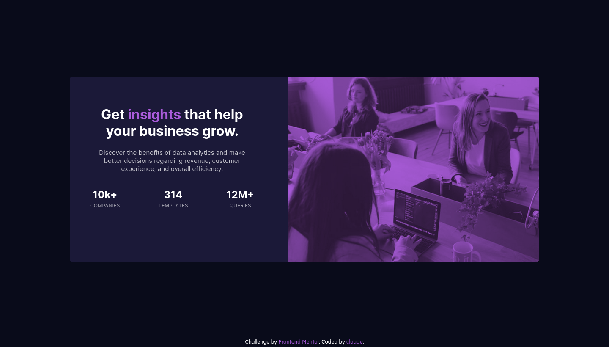
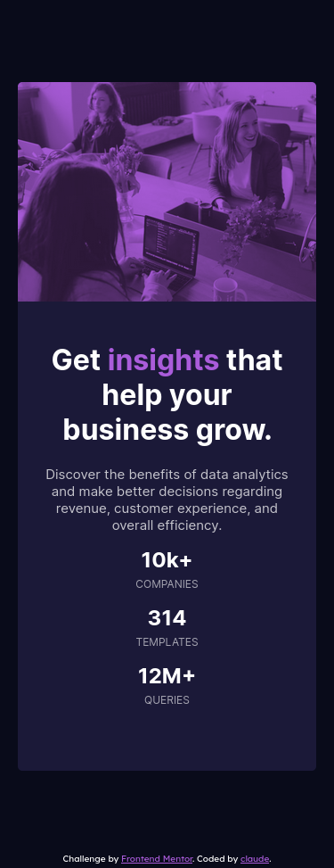

# Frontend Mentor - Stats preview card component solution

This is a solution to the [Stats preview card component challenge on Frontend Mentor](https://www.frontendmentor.io/challenges/stats-preview-card-component-8JqbgoU62). Frontend Mentor challenges help you improve your coding skills by building realistic projects.

## Table of contents

- [Overview](#overview)
  - [The challenge](#the-challenge)
  - [Screenshot](#screenshot)
  - [Links](#links)
- [My process](#my-process)
  - [Built with](#built-with)
- [Author](#author)

## Overview

### The challenge

Users should be able to:

- View the optimal layout depending on their device's screen size

### Screenshot

<h4>Desktop - 1440px</h4>
 

<h4>Desktop - 375px</h4>
 

### Links

- Solution URL: [FrontendMentor](https://www.frontendmentor.io/solutions/stats-preview-card-component-By2clSTXq)
- Live Site URL: [Vercel](https://stats-preview-card-component-claude.vercel.app/)

## My process

### Built with

- Semantic HTML5 markup
- CSS custom properties
- Flexbox
- Mobile-first workflow
- [Sass](https://sass-lang.com/) - CSS preprocessor

## Author

- Frontend Mentor - [@claude1018](https://www.frontendmentor.io/profile/claude1018)
